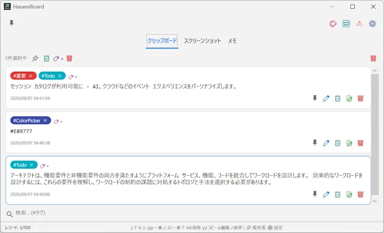
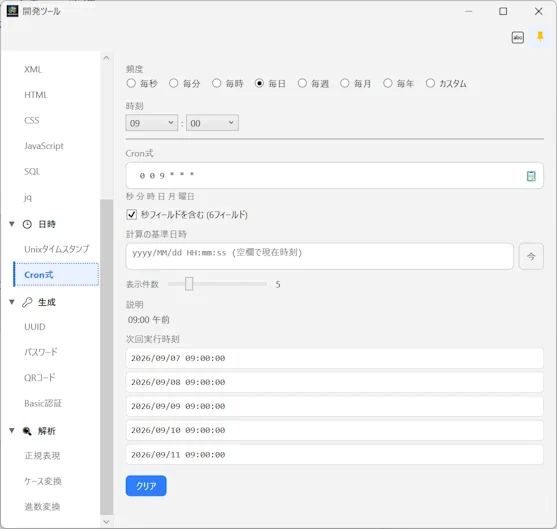

# HasamiBoard


<p align="left">
  
  
  
</p>

## 概要

Windows 11 向けのモダンなクリップボード管理ユーティリティです。
テキストのクリップボード履歴に加えて、スクリーンショット、メモにて、情報を一元管理できます。 
開発者があったら便利と思うツールもセットで使えます。

またこのアプリケーションは9割ほどAIで実装しています。


## 主な機能

### クリップボード
- テキストのコピー履歴を自動記録し、インライン編集・ピン留め・削除・タグ付与・クリップボードへの再コピーに対応

- 複数選択による一括ピン留め／一括コピー／一括タグ付与／一括削除

- 保持数上限（既定100件、最大500件）を設定でき、ピン留め項目は自動トリミングから保護

  

### スクリーンショット
- クリップボードに画像がキャプチャされると自動でレコードを追加（PNG / JPG / WebP で保存）

- 画像から主要な代表色を自動抽出し、カラーサークルからワンクリックで HEX コードをコピー

- Windows 標準 OCR (`Windows.Media.Ocr`) による文字認識をワンクリックで実行し、認識結果をメモへ自動反映

- スクリーンショットからメモを新規作成（画像・タグを引き継ぎ）


### メモ
- タイトル・モード（テキスト／Markdown）・本文・タグを持つ定型メモを管理
- 定型文テンプレート機能（日時プレースホルダー対応、Redmine の Issue テンプレートに類似）
- Markdown モードはリアルタイムプレビュー付きの垂直分割エディタ（完全ローカル描画、CDN 通信なし）
- `Ctrl+V` でのクリップボード画像／ファイルドロップ画像の貼り付けに対応
- フォント（種類・サイズ）をテキスト／Markdown 編集部／プレビュー部ごとに個別設定可能

  
### クイックフィルター
- リアルタイムで絞り込み検索に対応

### タグ管理
- マスタータグの追加・カラー変更・削除・リネームを一元管理
- 各カードにピルバッジでタグを表示し、`#タグ名` によるリアルタイム絞り込み検索に対応


### キーボードショートカット／Vim 風操作
- `Ctrl+Tab` でのタブ循環切替、`Ctrl+F` / `/` でのクイックフィルターフォーカス
- `j` / `k` / `gg` / `G` によるカーソル移動、`dd` / `yy` による削除・コピー（複数選択時は一括操作）

### カラーピッカー
- PowerToys 風の拡大ルーペ付きカラーピッカーをグローバルホットキー（既定 `Ctrl+Shift+C`）で起動
- 選択した HEX コードをクリップボード履歴へ自動記録

### 開発ツール
- ハッシュ生成（MD5 / SHA1 / SHA256 / SHA512）、Base64 / URL / HTML エンコード・デコード

- JSON / XML / HTML / CSS / JavaScript / SQL の各フォーマッタ（外部ランタイム不使用、C# 内完結処理）

- Unix タイムスタンプ ⇔ 日時変換（RFC3339/ISO8601 対応）、UUID（v4 / v5 / v7）生成、パスワード生成

- 正規表現テスター、JWT デコーダー、ケース変換、進数変換 など

    

### エラーコード一覧
- HTTP ステータスコード、POSIX `errno.h`、Windows エラーコード、SMTP 応答コードを検索・参照（完全オフライン）

### その他
- タスクトレイ常駐とグローバルホットキーによるウィンドウ表示切替
- 表示言語（自動 / 日本語 / English）とダーク／ライトテーマの切替
- 設定・データベース・画像一式をまとめてバックアップ／復元
- Windows スタートアップ自動起動（`/hide` オプションでタスクトレイに常駐した状態で起動）


## ビルド方法

### 必要環境
- Windows 11
- [.NET 10 SDK](https://dotnet.microsoft.com/) （`net10.0-windows10.0.26100.0` をターゲット）
- [Inno Setup 7](https://jrsoftware.org/isinfo.php) （インストーラーを作成する場合のみ）


### 単体テストの実行

```bash
$ dotnet test tests/HasamiBoard.Tests/HasamiBoard.Tests.csproj
```

### リリースビルド／インストーラー作成

Release ビルドとインストーラー作成を一括実行します。

```bash
$ build.bat
```

バージョン番号はプロジェクト直下の `VERSION` ファイルを唯一の情報源として、アセンブリバージョン・インストーラーの双方に自動反映されます。


## ライセンス

本ソフトウェアは [Apache License 2.0](https://www.apache.org/licenses/LICENSE-2.0) のもとで公開されています。詳細は `LICENSE` ファイルを参照してください。

本製品は LiteDB、Markdig、NUglify、SkiaSharp、QRCoder、ZXing.Net など、MIT / BSD-2-Clause / Apache-2.0 いずれかの寛容なオープンソースライセンスで提供されるサードパーティライブラリを利用しています。
